


I study how to make AI more powerful by <strong>fusing computer vision and large language models</strong> — not as separate tools, but as one coordinated system where perception, language, and the rest of the stack actually work together.

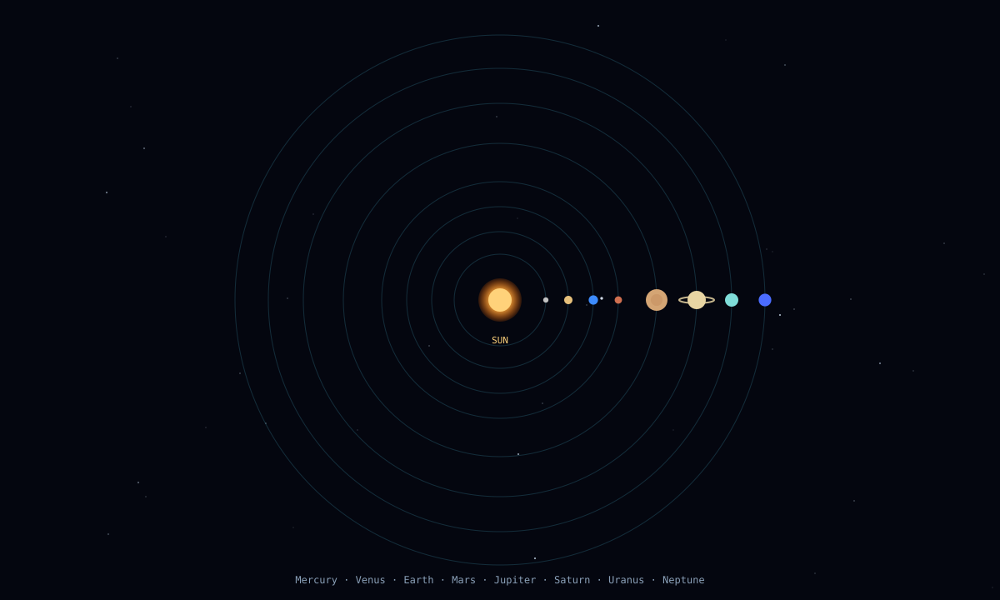

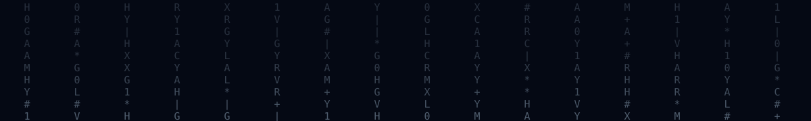


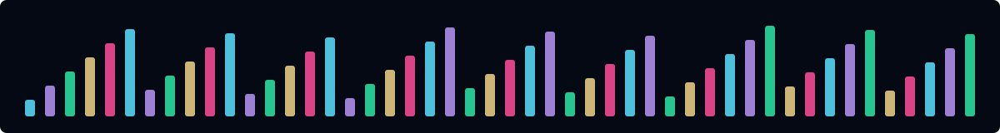

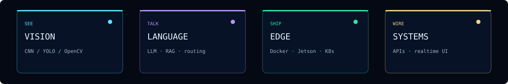

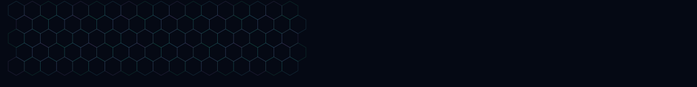

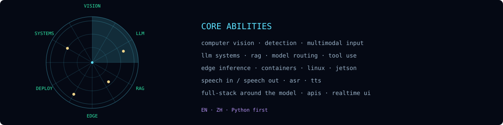

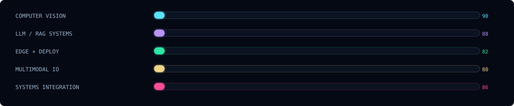

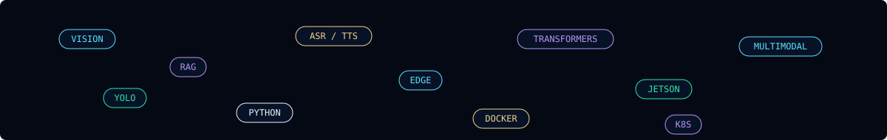

  

  
  
  
  
  
  
  
  
  

  
  

  

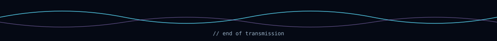

